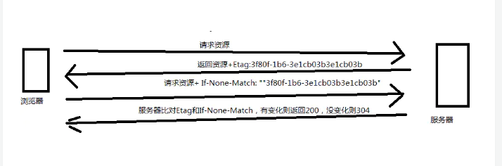

## http请求常见格式

一、get
请求参数拼接在url上,长度有限制，长度没有统一标准，由浏览器和web服务器决定
格式： ?key=value&key=value
示例:/charging-api/rest-api/v1/dict/getDictList?dictCode=ACCT_TASK_TYPE
axios会将参数自动拼接在url上,没有content-type

二、post
 1.content-type: 'application/x-www-form-urlencoded'
  格式：key=value&key=value String键值对形式
  使用axios时可用qs.stringify()处理

  2.content-type: 'multipart/form-data'
  由于有boundary隔离，所以multipart/form-data既可以上传文件，也可以上传键值对，它采用了键值对的方式，所以可以上传多个文件。
  使用axios时，需使用FormData对象来构建参数,axios不设置content-type，浏览器会自动设置

  3.content-type:'application/json'
  json格式,最常用的参数请求格式
  格式:json字符串
  axios会将对象格式化成json字符串

在使用axios时不需要设置content-type，axios会根据参数类型，自动设置content-type
源码：
// lib/defaults.js 文件

var DEFAULT_CONTENT_TYPE = {
  'Content-Type': 'application/x-www-form-urlencoded'
};

....

var defaults = {
  adapter: getDefaultAdapter(),

  transformRequest: [function transformRequest(data, headers) {
    normalizeHeaderName(headers, 'Accept');
    normalizeHeaderName(headers, 'Content-Type');
    if (utils.isFormData(data) ||
      utils.isArrayBuffer(data) ||
      utils.isBuffer(data) ||
      utils.isStream(data) ||
      utils.isFile(data) ||
      utils.isBlob(data)
    ) {
      return data;
    }
    if (utils.isArrayBufferView(data)) {
      return data.buffer;
    }
    if (utils.isURLSearchParams(data)) {
      setContentTypeIfUnset(headers, 'application/x-www-form-urlencoded;charset=utf-8');
      return data.toString();
    }
    if (utils.isObject(data)) {
      setContentTypeIfUnset(headers, 'application/json;charset=utf-8');
      return JSON.stringify(data);
    }
    return data;
  }]
};

// lib/adapters/xhr.js

module.exports = function xhrAdapter(config) {
  return new Promise(function dispatchXhrRequest(resolve, reject) {
        // config 是传入的配置对象 如： {url,method,data,headers}
        // 获取传入的参数和请求头
        var requestData = config.data;
        var requestHeaders = config.headers;
        // 判断是否为 formData 实例，如果是删除 请求头中的 content-type
        if (utils.isFormData(requestData)) {
          delete requestHeaders['Content-Type']; // Let the browser set it
        }
  })
}

## 强缓存，协商缓存
### 强缓存
强缓存：浏览器不会像服务器发送任何请求，直接从本地缓存中读取文件并返回Status Code: 200 OK(form memory cache or from disk cache)
1、Expires：响应头部过期时间，如果设置了时间，则浏览器会在设置的时间内直接读取缓存，不再请求 例:Expires: Wed, 21 Oct 2015 07:28:00 GMT
2、Cache-Control
（1） max-age：用来设置资源（representations）可以被缓存多长时间，单位为秒；
（2） s-maxage：和max-age是一样的，不过它只针对代理服务器缓存而言；
（3）public：指示响应可被任何缓存区缓存；
（4）private：只能针对个人用户，而不能被代理服务器缓存；
（5）no-cache：强制客户端直接向服务器发送请求,也就是说每次请求都必须向服务器发送。服务器接收到请求，然后判断资源是否变更，是则返回新内容，否则返 回304，未变更。这个很容易让人产生误解，使人误以为是响应不被缓存。实际上Cache-Control:no-cache是会被缓存的，只不过每次在向客户端（浏览器）提供响应数据时，缓存都要向服务器评估缓存响应的有效性。
（6）no-store：禁止一切缓存（这个才是响应不被缓存的意思）

优先级:
cache-control>expires
cache-control是http1.1的头字段，expires是http1.0的头字段,如果expires和cache-control同时存在，cache-control会覆盖expires

### 启发式缓存 
如果Expires，Cache-Control: max-age，或 Cache-Control:s-maxage都没有在响应头中出现，并且设置了Last-Modified时，那么浏览器默认会采用一个启发式的算法，即启发式缓存。通常会取响应头的Date_value - Last-Modified_value值的10%作为缓存时间。

### 协商缓存
协商缓存: 向服务器发送请求，服务器会根据这个请求的request header的一些参数来判断是否命中协商缓存，如果命中，则返回304状态码并带上新的response header通知浏览器从缓存中读取资源；
1、Etag/If-None-Match
Etag：
> Etag是属于HTTP 1.1属性，它是由服务器（Apache或者其他工具）生成返回给前端，用来帮助服务器控制Web端的缓存验证。
Apache中，ETag的值，默认是对文件的索引节（INode），大小（Size）和最后修改时间（MTime）进行Hash后得到的。

If-None-Match:
> 当资源过期时，浏览器发现响应头里有Etag,则再次像服务器请求时带上请求头if-none-match(值是Etag的值)。服务器收到请求进行比对，决定返回200或304

2、Last-Modifed/If-Modified-Since
Last-Modified 表示本地文件最后修改日期，浏览器会在request header加上If-Modified-Since（上次返回的Last-Modified的值），询问服务器在该日期后资源是否有更新，有更新的话就会将新的资源发送回来

优先级 Etag/If-None-Match > Last-Modifed/If-Modified-Since

<meta http-equiv="Cache-control" content="no-cache" />
<meta http-equiv="Cache-Control" content="max-age=0" />

## https
参考
[理解公钥与私钥](https://songlee24.github.io/2015/05/03/public-key-and-private-key/)
[SSL/TLS协议运行机制的概述](https://www.ruanyifeng.com/blog/2014/02/ssl_tls.html)
[数字签名是什么？](http://www.ruanyifeng.com/blog/2011/08/what_is_a_digital_signature.html)

### 公钥与秘钥
#### 私钥
私钥加密算法，又称对称加密算法，因为这种算法解密密钥和加密密钥是相同的。也正因为同一密钥既用于加密又用于解密，所以这个密钥是不能公开的。

#### 公钥
公钥加密算法，也就是 非对称加密算法，这种算法加密和解密的密码不一样，一个是公钥，另一个是私钥。
用公钥加密的数据只有对应的私钥可以解密，用私钥加密的数据只有对应的公钥可以解密。
公钥和私钥是相对的，两者本身并没有规定哪一个必须是公钥或私钥。

现实中，公钥机制也有它的缺点，那就是效率非常低，比常用的私钥算法（如 DES 和 AES）慢上一两个数量级都有可能。所以它不适合为大量的原始信息进行加密。为了同时兼顾安全和效率，我们通常结合使用公钥算法和私钥算法：
首先，发送方使用对称算法对原始信息进行加密。
接收方通过公钥机制生成一对密钥，一个公钥，一个私钥。
接收方 将公钥发送给 发送方。
发送方用公钥对对称算法的密钥进行加密，并发送给接收方。
接收方用私钥进行解密得到对称算法的密钥。
发送方再把已加密的原始信息发送给接收方。
接收方使用对称算法的密钥进行解密。

### https
https的安全特点：
防窃听（会话秘钥）、防篡改（数字签名）、防冒充（数字证书）

#### 数字签名
摘要：一段信息，经过摘要算法(Hash函数)得到一串哈希值，就是摘要。摘要相同，信息一定相同。
数字签名：摘要经过加密，就得到数字签名
发送方对内容进行hash处理得到摘要，再对摘要进行加密得到数字签名，发送给对方;接受方拿到数字签名和内容，利用密钥解密得到摘要,再对内容hash处理得到摘要，如果摘要一致，则说明未被篡改

#### 数字证书
数字证书：发送方先把自己的公钥给CA，CA对其进行加密得到加密后的发送方公钥（用的是CA的私钥和CA加密算法），也就是CA的数字证书。
数字证书认证过程:
浏览器内置一个受信任的CA机构列表，并保存了这些CA机构的证书。第一阶段服务器会提供经CA机构认证颁发的服务器证书，如果签发该证书的CA，存在于浏览器的受信任CA列表中（也就是签发该证书的CA的根证书，能够与客户端中保存的CA根证书比对上），说明这个CA是可信任的，可以保证证书不假。然后，再进一步判断服务器证书中的信息与当前正在访问的网站（域名等）一致，那么浏览器就认为服务端是可信的，并从服务器证书中取得服务器公钥，用于后续流程。否则，浏览器将提示用户，根据用户的选择，决定是否继续。

#### 会话秘钥(对称加密)
会话秘钥的生成机制主要有RSA算法和DH算法
握手过程（生成对话秘钥）:
1、客户端发出请求:
（1） 支持的协议版本，比如TLS 1.0版。

（2） 一个客户端生成的随机数，稍后用于生成"对话密钥"。

（3） 支持的加密方法，比如RSA公钥加密。

2、服务器回应：
（1） 确认使用的加密通信协议版本，比如TLS 1.0版本。如果浏览器与服务器支持的版本不一致，服务器关闭加密通信。

（2） 一个服务器生成的随机数，稍后用于生成"对话密钥"。

（3） 确认使用的加密方法，比如RSA公钥加密。

（4） 服务器证书。

3、客户端回应：
首先验证服务器证书。如果证书不是可信机构颁布、或者证书中的域名与实际域名不一致、或者证书已经过期，就会向访问者显示一个警告，由其选择是否还要继续通信
（1） 一个随机数。该随机数用服务器公钥加密，防止被窃听。

（2） 编码改变通知，表示随后的信息都将用双方商定的加密方法和密钥发送。

（3） 客户端握手结束通知，表示客户端的握手阶段已经结束。这一项同时也是前面发送的所有内容的hash值，用来供服务器校验。

4、服务器的最后回应
（1）编码改变通知，表示随后的信息都将用双方商定的加密方法和密钥发送。

（2）服务器握手结束通知，表示服务器的握手阶段已经结束。这一项同时也是前面发送的所有内容的hash值，用来供客户端校验。

至此，整个握手阶段全部结束。接下来，客户端与服务器进入加密通信，就完全是使用普通的HTTP协议，只不过用"会话密钥"加密内容。

### Cookie && Session && Token
#### Cookie
[HTTP cookies(MDN)](https://developer.mozilla.org/zh-CN/docs/Web/HTTP/Cookies)
Cookie是服务器发送到用户浏览器并保存在本地的一小块数据，它会在浏览器下次向同一服务器再发起请求时被携带并发送到服务器上。

大小限制
4k

属性
1、HttpOnly: Document.cookie API 无法访问带有 HttpOnly 属性的cookie
2、Secure:标记为 Secure 的 Cookie 只应通过被 HTTPS 协议加密过的请求发送给服务端(此时cookie只在https协议下有效)

Cookie 的作用域
Domain 和 Path 标识定义了Cookie的作用域：即允许 Cookie 应该发送给哪些URL。
3、Domain:指定了哪些主机可以接受 Cookie。如果不指定，默认为 origin，不包含子域名。如果指定了Domain，则一般包含子域名。因此，指定 Domain 比省略它的限制要少。
4、Path:标识指定了主机下的哪些路径可以接受 Cookie（该 URL 路径必须存在于请求 URL 中）
5、SameSite
6、Cookie prefixes

#### Session
[Session和Cookie的用法及区别](https://juejin.cn/post/6844903952157245453)

Session是另一种记录客户状态的机制，不同的是Cookie保存在客户端浏览器中，而Session保存在服务器上。客户端浏览器访问服务器的时候，服务器把客户端信息以某种形式记录在服务器上，这就是Session。客户端浏览器再次访问时只需要从该Session中查找该客户的状态就可以了。每个用户访问服务器都会建立一个session并自动分配一个SessionId，用于标识用户的唯一身份。(cookie可以作为session的载体)

与cookie的区别:
1、cookie数据存放在客户的浏览器上，session数据放在服务器上。
2、cookie不是很安全，别人可以分析存放在本地的cookie并进行cookie欺骗，考虑到安全应当使用session。
3、session会在一定时间内保存在服务器上。当访问增多，会比较占用你服务器的性能，考虑到减轻服务器性能方面，应当使用cookie。

#### Token
Token是客户端第一次请求认证后,服务端进行校验，校验成功将用户信息等经过Base64Url编码过后传给在客户端，客户端之后都带着token进行请求，服务端直接通过这个token认证，从而响应请求

流程：
第一次请求时，用户发送账号与密码
后台校验通过，则会生成一个有时效性的token,再将此token发送给用户
用户获得token后，将此token存储在本地，一般存储在localstorage或cookie
之后的每次请求都会将此token添加在请求头里，所有需要校验身份的接口都会被校验token，若token解析后的数据包含用户身份信息，则身份验证通过。

### 跨域
同源：协议、域名、端口相同
[前端常见跨域解决方案](https://segmentfault.com/a/1190000011145364)

解决跨域的方法
1、jsonp
2、nginx
配置例子:
location /api {
   proxy_pass https://b.test.com;
   proxy_cookie_domain b.test.com  a.test.com;
}
3、cors
[跨域资源共享 CORS 详解](https://www.ruanyifeng.com/blog/2016/04/cors.html)
1、简单请求
请求包含Origin字段，服务器返回Access-Control-Allow-Origin;如需cookie要另外处理

2、复杂请求
首先会发起一个预检请求,浏览器自动发起；服务器需设置回应
配置例子：
location / {  
  add_header Access-Control-Allow-Origin *;
  add_header Access-Control-Allow-Methods 'GET, POST, OPTIONS';
  add_header Access-Control-Allow-Headers 'DNT,X-Mx-ReqToken,Keep-Alive,User-Agent,X-Requested-With,If-Modified-Since,Cache-Control,Content-Type,Authorization';
} 
4、node服务器
5、vue的http-proxy-middleware
6、WebSocket协议跨域

### http代理的两种形式
1、普通代理
2、隧道代理

### http2
[HTTP2 详解](https://juejin.cn/post/6844903667569541133)

新特性：
多路复用(帧和流的概念)
一个请求分被分为多个帧，一个请求是一个流，一个连接可以有多个流，不同流中的帧可以无序发送，同一个流中的帧是有序的
header压缩
服务端推送

### CDN + DNS
[CDN原理简析](https://juejin.cn/post/6844903873518239752)
