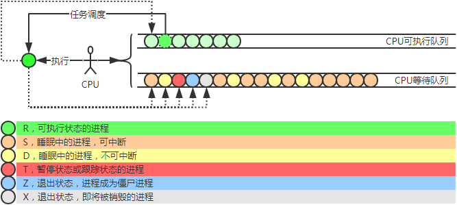
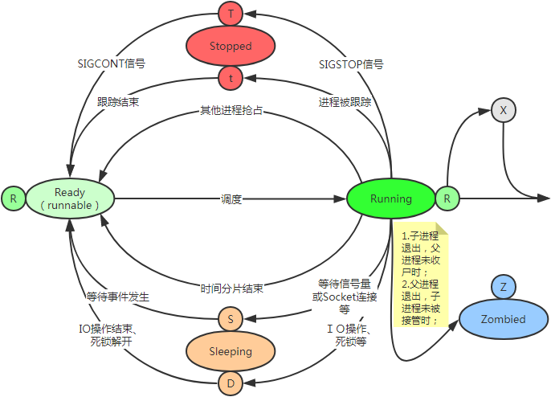

## linux常用命令

### 下载
wget
curl

### 文件目录操作
cd
mv
cp
rm

### 内存
free -h
top

### 磁盘
df -h
检查文件系统的磁盘空间占用情况

du -sh 
du -sh ./*
检查磁盘空间使用量

du --max-depth=1 -h
查看当前目录下文件夹磁盘占用情况

## 进程
查看进程pid
ps -ef | grep 进程名
ps aux | grep 进程名

进程状态
R: 运行或等待运行状态
S: 睡眠状态
X: 退出状态，即将被销毁

## 查看日志
tail -f catalina.out
head
less
more
cat

## 压缩文件
压缩 tar -czvf contract-manage.tar.gz contract-manage
解压 tar -xzvf contract-manage.tar.gz

## 查找文件
find / -name jenkins.war

## 登录
ssh -p 2222 user@host

## vi

启动doclever 
目录/public/apimanage/DOClever/Server/bin/www
nohup node /public/apimanage/DOClever/Server/bin/www &
exit

启动jenkins
cd /data/uhomeres/jenkins
java -jar jenkins.war