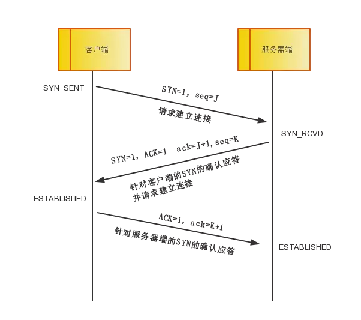

#TCP/IP协议栈

##1、概述
TCP/IP 协议栈是一系列网络协议的总和，是构成网络通信的核心骨架，它定义了电子设备如何连入因特网，以及数据如何在它们之间进行传输。TCP/IP 协议采用4层结构，分别是应用层、传输层、网络层和链路层，每一层都呼叫它的下一层所提供的协议来完成自己的需求。通俗一点讲就是，一个主机的数据要经过哪些过程才能发送到对方的主机上。

- tcp/ip协议的基本框架

当通过http发起一个请求时，应用层、传输层、网络层和链路层的相关协议依次对该请求进行包装并携带对应的首部，最终在链路层生成以太网数据包，以太网数据包通过物理介质传输给对方主机，对方接收到数据包以后，然后再一层一层采用对应的协议进行拆包，最后把应用层数据交给应用程序处理。
> 问题
1、数据包如何从一个子网传输到另一个子网
2、为什么不是两次握手
##2、链路层

1、链路层的主要工作就是对比特流数据进行分组并形成具有特定意义的数据帧，然后以广播的形式通过物理介质发送给接收方。
2、整个数据帧由首部、数据和尾部三部分组成，首部固定为14个字节，包含了目标MAC地址、源MAC地址和类型；数据最短为46个字节，最长为1500个字节，如果需要传输的数据很长，就必须分割成多个帧进行发送；尾部固定为4个字节，表示数据帧校验序列，用于确定数据包在传输过程中是否损坏。
3、有了MAC地址以后，以太网采用广播形式，把数据包发给该子网内所有主机，子网内每台主机在接收到这个包以后，都会读取首部里的目标MAC地址，然后和自己的MAC地址进行对比，如果相同就做下一步处理，如果不同，就丢弃这个包。

> MAC地址: 是每块网卡的身份标识，MAC地址采用十六进制标识，共6个字节， 前三个字节是厂商编号，后三个字节是网卡流水号，例如 4C-0F-6E-12-D2-19

> 交换机: 是一种用于电（光）信号转发的网络设备。它可以为接入交换机的任意两个网络节点提供独享的电信号通路

> 问题
1、目标主机的MAC地址怎么取到
<!-- ipconfig /all  -->

##3、网络层
网络层的主要工作是定义网络地址，区分网段，子网内MAC寻址，对于不同子网的数据包进行路由。
IP数据包由首部和数据两部分组成，首部长度为20个字节，主要包含了目标IP地址和源IP地址，目标IP地址是网关路由的线索和依据。

- 同一子网

### IP协议
#### ipv4
IPv4是一个32位的地址，常采用4个十进制数字表示。IP协议将这个32位的地址分为两部分，前面部分代表网络地址，后面部分表示该主机在子网中的地址。
比如：192.168.1.4
> 子网掩码 它是一种用来指明一个IP地址的哪些位标识的是主机所在的子网，以及哪些位标识的是主机的位掩码

如何计算ip地址的网络地址和主机地址:
- 将ip地址和子网掩码按位与运算就可以得到网络地址
- 将二进制形式的子网掩码取反，将取反后的子网掩码与 IP 地址做与运算
ip地址：192.168.1.4 ，子网掩码: 255.255.255.0
1 1 0 0 0 0 0 0.1 0 1 0 1 0 0 0.0 0 0 0 0 0 0 1.0 0 0 0 0 1 0 0
1 1 1 1 1 1 1 1.1 1 1 1 1 1 1 1.1 1 1 1 1 1 1 1.0 0 0 0 0 0 0 0

结果：
网络地址：192.168.1.0
主机地址：4
1 1 1 1 1 1 1 1.1 1 1 1 1 1 1 0.1 1 1 1 1 1 1 1.0 0 0 0 0 0 0 0
#### ipv6
### ARP协议
即地址解析协议，是根据IP地址获取MAC地址的一个网络层协议。其工作原理如下：ARP首先会发起一个请求数据包，数据包的首部包含了目标主机的IP地址，然后这个数据包会在链路层进行再次包装，生成以太网数据包，最终由以太网广播给子网内的所有主机，每一台主机都会接收到这个数据包，并取出标头里的IP地址，然后和自己的IP地址进行比较，如果相同就返回自己的MAC地址，如果不同就丢弃该数据包。ARP接收返回消息，以此确定目标机的MAC地址；与此同时，ARP还会将返回的MAC地址与对应的IP地址存入本机ARP缓存中并保留一定时间，下次请求时直接查询ARP缓存以节约资源。cmd输入 arp -a 就可以查询本机缓存的ARP数据。

<!-- 公网和内网 -->

### 路由协议
通过ARP协议的工作原理可以发现，ARP的MAC寻址还是局限在同一个子网中，因此网络层引入了路由协议，首先通过IP协议来判断两台主机是否在同一个子网中，如果在同一个子网，就通过ARP协议查询对应的MAC地址，然后以广播的形式向该子网内的主机发送数据包；如果不在同一个子网，以太网会将该数据包转发给本子网的网关进行路由。网关会进行多次转发，最终将该数据包转发到目标IP所在的子网中，然后再通过ARP获取目标机MAC，最终也是通过广播形式将数据包发送给接收方。

> 网关 是具有路由功能的设备,它可以转发数据

#### 路由表
路由表是一个存储在路由器或者联网计算机中的电子表格（文件）或类数据库。路由表存储着指向特定网络地址的路径

1、静态路由
是网络管理员手工配置的转发路径,不变的

2、动态路由
路由器之间适时地交换路由信息，路由器根据某种路由算法（不同的动态路由协议算法不同）把收集到的路由信息加工成路由表
- 不同子网

> 问题
1、只有ip地址能不能判断网络地址
2、网关是怎么转发数据

##4、传输层
<!-- 链路层定义了主机的身份，即MAC地址， 而网络层定义了IP地址，明确了主机所在的网段，有了这两个地址，数据包就从可以从一个主机发送到另一台主机。但实际上数据包是从一个主机的某个应用程序发出，然后由对方主机的应用程序接收。而每台电脑都有可能同时运行着很多个应用程序，所以当数据包被发送到主机上以后，是无法确定哪个应用程序要接收这个包。 -->
作用：定义端口，标识应用程序身份，实现端口到端口的通信，TCP协议可以保证数据传输的可靠性。
### UDP
- tcp/udp的比较

ssh 22
mysql 3306
http 80
https 443
ftp 21
### TCP
#### tcp三次握手

1: syn = 1,seq = j
2：syn = 1,ACK = 1,ack = j + 1, seq = k
3：ACk = 1，ack = k + 1
- tcp报文格式

<!-- telnet 192.168.1.11 10080 -->
<!-- ip.dst==192.168.1.11 -->
序号(seq): tcp报文段所发送的数据的第一个字节的序号
确认序号(ack): 期望收到对方下一个报文段的第一个数据字节的序号
标志位
同步(SYN): 在连接建立时用来同步序号。当SYN＝1而ACK＝0时，表明这是一个连接请求报文段。对方若同意建立连接，则应在响应的报文段中使SYN＝1和ACK＝1。
确认(ACK):  仅当ACK＝1时确认号字段才有效。当ACK＝0时，确认号无效。TCP规定，在连接建立后所有传送的报文段都必须把ACK置1。
终止(FIN): 用来释放一个连接。当FIN＝1时，表明此报文段的发送方的数据已发送完毕，并要求释放运输连接。
复位(RST):  当RST＝1时，表明TCP连接中出现严重差错,必须释放连接，然后再重新建立运输连接
#### TCP KeepAlive
隔一段时间给连接对端发送一个探测包，如果收到对方回应的 ACK，则认为连还是存活的，在超过一定重试次数之后还是没有收到对方的回应，则丢弃该TCP 连接。
#### SYN攻击
Syn攻击就是 攻击客户端 在短时间内伪造大量不存在的IP地址，向服务器不断地发送syn包，服务器回复确认包，并等待客户的确认，由于源地址是不存在的，服务器需要不断的重发直 至超时，这些伪造的SYN包将长时间占用未连接队列，正常的SYN请求被丢弃，目标系统运行缓慢，严重者引起网络堵塞甚至系统瘫痪。
### 四次挥手

##5、应用层：
主要工作就是定义数据格式并按照对应的格式解读数据。
##6、总结
<!-- - 当你输入一个网址并按下回车键的时候，首先，应用层协议对该请求包做了格式定义；紧接着传输层协议加上了双方的端口号，确认了双方通信的应用程序；然后网络协议加上了双方的IP地址，确认了双方的网络位置；最后链路层协议加上了双方的MAC地址，确认了双方的物理位置，同时将数据进行分组，形成数据帧，采用广播方式，通过传输介质发送给对方主机。而对于不同网段，该数据包首先会转发给网关路由器，经过多次转发后，最终被发送到目标主机。目标机接收到数据包后，采用对应的协议，对帧数据进行组装，然后再通过一层一层的协议进行解析，最终被应用层的协议解析并交给服务器处理。 -->
以用户 a 向用户 b 发送邮件为例子
- ① 应用程序处理首先应用程序会进行编码处理，这些编码相当于 OSI 的表示层功能；编码转化后，邮件不一定马上被发送出去，这种何时建立通信连接何时发送数据的管理功能，相当于 OSI 的会话层功能。
- ② TCP 模块的处理TCP 根据应用的指示，负责建立连接、发送数据以及断开连接。TCP 提供将应用层发来的数据顺利发送至对端的可靠传输。为了实现这一功能，需要在应用层数据的前端附加一个 TCP 首部。
- ③ IP 模块的处理IP 将 TCP 传过来的 TCP 首部和 TCP 数据合起来当做自己的数据，并在 TCP 首部的前端加上自己的 IP 首部。IP 包生成后，参考路由控制表决定接受此 IP 包的路由或主机。
- ④ 网络接口（以太网驱动）的处理从 IP 传过来的 IP 包对于以太网来说就是数据。给这些数据附加上以太网首部并进行发送处理，生成的以太网数据包将通过物理层传输给接收端。
<!-- - ⑤ 网络接口（以太网驱动）的处理主机收到以太网包后，首先从以太网包首部找到 MAC 地址判断是否为发送给自己的包，若不是则丢弃数据。如果是发送给自己的包，则从以太网包首部中的类型确定数据类型，再传给相应的模块，如 IP、ARP 等。这里的例子则是 IP 。
- ⑥ IP 模块的处理IP 模块接收到 数据后也做类似的处理。从包首部中判断此 IP 地址是否与自己的 IP 地址匹配，如果匹配则根据首部的协议类型将数据发送给对应的模块，如 TCP、UDP。这里的例子则是 TCP。另外吗，对于有路由器的情况，接收端地址往往不是自己的地址，此时，需要借助路由控制表，在调查应该送往的主机或路由器之后再进行转发数据。
- ⑦ TCP 模块的处理在 TCP 模块中，首先会计算一下校验和，判断数据是否被破坏。然后检查是否在按照序号接收数据。最后检查端口号，确定具体的应用程序。数据被完整地接收以后，会传给由端口号识别的应用程序。
- ⑧ 应用程序的处理接收端应用程序会直接接收发送端发送的数据。通过解析数据，展示相应的内容。 -->

### tcp补充
[谈谈用户态 TCP 协议实现](https://zhuanlan.zhihu.com/p/412758694)
[彻底弄懂TCP协议：从三次握手说起](https://cloud.tencent.com/developer/article/1687824)

#### tcp和udp的区别:
tcp是面向字节流的，而udp是面向报文
TCP是有缓冲区，作为对比，UDP面向报文段是没有缓冲区的。TCP发送报文时，是将应用层数据写入TCP缓冲区中，然后由TCP协议来控制发送这里面的数据，而发送的状态是按字节流的方式发送的，跟应用层写下来的报文长度没有任何关系，所以说是流。作为对比的UDP，它没有缓冲区，应用层写的报文数据会直接加包头交给网络层，由网络层负责分片，所以是面向报文段的。

##### tcp的特点
1、TCP是面向连接的运输层协议
2、每一条TCP连接只能有两个端点，每一条TCP连接只能是点对点的（一对一）
3、TCP提供可靠交付的服务。通过TCP连接传送的数据，无差错、不丢失、不重复，并且按序到达。
4、TCP提供全双工通信
5、面向字节流

TCP连接的端点:套接字(IP地址加端口号)
连续ARQ协议:指发送方维持着一个一定大小的发送窗口，位于发送窗口内的所有分组都可连续发送出去，而中途不需要等待对方的确认。这样信道的利用率就提高了。而发送方每收到一个确认就把发送窗口向前滑动一个分组的位置。接收方一般都是采用积累确认的方式。这就是说，接收方不必对收到的分组逐个发送确认，而是在收到几个分组后，对按序到达的最后一个分组发送确认，这就表示：到这个分组为止的所有分组都已正确收到了。

TCP首部的固定长度是20字节（最小长度），带选项的话最大可达60字节
##### tcp首部字段
源端口
目的端口
序号:序号范围是［0，2^32–1］
确认号:是期望收到对方下一个报文段的第一个数据字节的序号
首部长度
紧急URG
确认ACK：ACK＝1时确认号字段才有效
推送PSH:当两个应用进程进行交互式的通信时，有时在一端的应用进程希望在键入一个命令后立即就能够收到对方的响应。
复位RST
同步SYN:SYN置为1就表示这是一个连接请求或连接接受报文
终止FIN:用来释放一个连接
窗口:允许对方发送的数据量(只计算数据部分，不算首部)
检验和:检验和字段检验的范围包括首部和数据这两部分
紧急指针:紧急指针指出了紧急数据的末尾在报文段中的位置
最大报文段长度MSS: MSS是每一个TCP报文段中的数据字段的最大长度,默认值是536字节长
窗口扩大选项:
时间戳选项
选择确认选项SACK:指明字节块的边界信息

超时重传时间:略大于加权平均往返时间RTTS,有公式可算
##### tcp的流量控制
1、利用滑动窗口实现流量控制:让发送方的发送速率不要太快，要让接收方来得及接收
窗口大小一直在变化
- 持续计时器:若持续计时器设置的时间到期，就发送一个零窗口探测报文段（仅携带1字节的数据），而对方就在确认这个探测报文段时给出了现在的窗口值。如果窗口仍然是零，那么收到这个报文段的一方就重新设置持续计时器。如果窗口不是零，那么死锁的僵局就可以打破了。
2、控制发送时机
  a、只要缓存中存放的数据达到MSS字节时，就组装成一个TCP报文段发送出去
  b、发送方的应用进程指明要求发送报文段，即TCP支持的推送（push）操作
  c、是发送方的一个计时器期限到了
  d、Nagle算法

##### TCP的拥塞控制
拥塞控制就是防止过多的数据注入到网络中，这样可以使网络中的路由器或链路不致过载。拥塞控制所要做的都有一个前提，就是网络能够承受现有的网络负荷。拥塞控制是一个全局性的过程，涉及到所有的主机、所有的路由器，以及与降低网络传输性能有关的所有因素
判断网络拥塞的依据就是出现了超时

拥塞控制方法:
慢开始算法:每经过一个传输轮次（transmission round），拥塞窗口cwnd就加倍
拥塞避免算法:每经过一个传输轮次（transmission round），拥塞窗口cwnd就加1
快重传算法:发送方只要一连收到3个重复确认，就知道接收方确实没有收到报文段M3，因而应当立即进行重传（即“快重传”），这样就不会出现超时，发送方也不就
会误认为出现了网络拥塞。
快恢复
BBR算法

### 计算机网络分层
应用层：运输层为应用进程提供了端到端的通信，应用层则解决了应用与应用之间的通信，以及如何利用这些通信服务。应用层协议定义的是应用进程间通信和交 互的规则。

传输层：运输 层为应用进程之间提供端到端的逻辑通信。运输层的任务就是负责向两台主机中进程 之间的通信提供通用的数据传输服务。（差错控制、重传机制、流量控制）

网络层：网络层负责为分组交换网上的不同主机提供 通信服务。

<!-- 链路层：链路层的主要工作就是对比特流数据进行分组并形成具有特定意义的数据帧，然后以广播的形式通过物理介质发送给接收方 -->

数据链路层：数据链路层将网络层交下来的IP数据报组装成帧，在两个相邻节点间的线路上无差错地传送以帧（Frame）为单位的数据。每一帧包括数据和必要的控制信息（如同步信息、地址信息、差错控制等）

物理层：它利用传输介质为数据链路层提供物理连接。它主要关心的是通过物理链路从一个结点向另一个结点传送比特流。物理层只传输比特流，更多工作由链路层完成

为什么同时存在ip地址和mac地址 不直接使用ip地址或mac地址通信？
主机发送时怎么知道另一个主机在同一个网络还是不同网络 何时发给路由器

## 网络层
### 1、网络层提供的服务:
网络层向上只提供简单灵活的、无连接的、尽最大努力交付的数据报服务

### 2、IP协议
#### 分类的IP地址
IP地址 = 网络号 + 子网号 + 主机号
常用的三类IP地址:

#### ARP协议
作用：根据IP地址获取硬件地址

### 3、子网
划分子网：从网络的主机号借用若干位作为子网号
子网掩码：把子网掩码和IP地址进行逐位的“与”运算（AND），就可得出网络地址

### 4、无分类编址（超网）
IP地址 = 网络前缀 + 主机号

<!-- ### 5、网际控制报文协议ICMP
ICMP允许主机或路由器报告差错情况和提供有关异常情况的报告 -->

### 6、路由选择协议
#### 内部网关协议RIP
RIP是一种分布式的基于距离向量的路由选择协议
交换的信息：是当前本路由器所知道的全部信息，即自己现在的路由表（到目的网络N，距离是d，下一跳路由器是X）
仅和相邻路由器交换信息

#### 内部网关协议OSPF
OSPF最主要的特征就是使用分布式的链路状态协议
交换的信息：与本路由器相邻的所有路由器的链路状态。所谓“链路状态”就是说明本路由器都和哪些路由器相邻，以及该链路的“度量”。OSPF将这个“度量”用来表示费
用、距离、时延、带宽，等等。
使用洪泛法向本自治系统中所有路由器发送信息。

#### 外部网关协议BGP
BGP采用了路径向量路由选择协议
交换的信息：边界网关协议BGP所交换的网络可达性的信息就是要到达某个网络（用网络前缀表示）所要经过的一系列自治系统
(目的网络前缀、下一跳路由器，以及到达该目的网络所要经过的自治系统序列)

### 问题
传输层
1. tcp序号怎么设置
2. 三次握手四次挥手过程包丢失超时，谁会重传